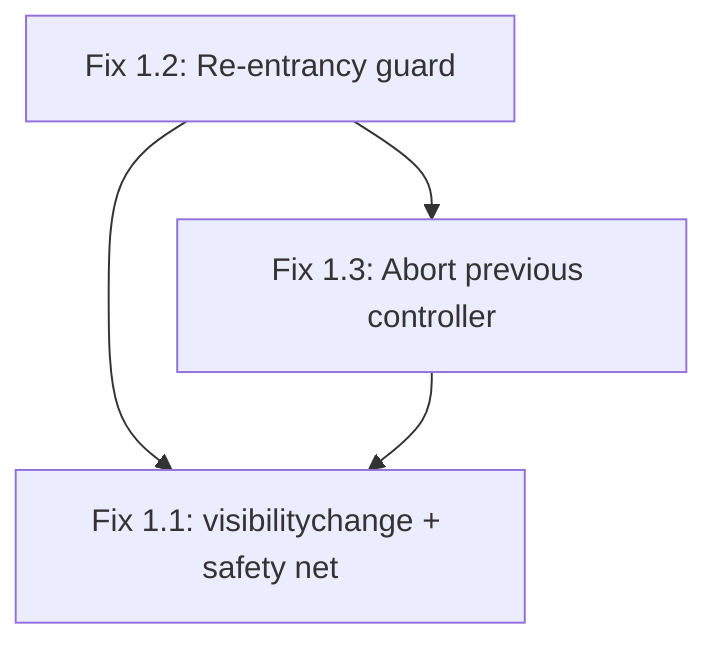

# Critical Issues Fix Plan

This plan addresses the 3 critical issues identified in the error analysis. The fixes are ordered by dependency: 1.2 and 1.3 should be implemented first (they are prerequisites for a clean 1.1 fix), then 1.1.

---

## Fix 1.2 — Re-entrancy guard on `SceneManager.goToScene()`

**File:** [`src/js/core/SceneManager.js`](src/js/core/SceneManager.js)

**Problem:** `goToScene()` is async with no lock. Concurrent calls interleave their `await`s, causing double `onEnter()`/`onExit()`, visual glitches, and orphaned listeners.

**Fix:** Add a module-level `isTransitioning` flag. Drop any concurrent call silently.

```js
// Add at module level (near line 18)
let isTransitioning = false
```

```js
// Modify goToScene (line 67)
async goToScene(sceneName, showTitle = true) {
    if (isTransitioning) return
    isTransitioning = true

    try {
        // ... existing body unchanged ...
    } finally {
        isTransitioning = false
    }
}
```

**Why drop instead of queue:** A queued transition would fire after the current one completes, potentially navigating away from a scene the user just arrived at. Dropping is safer — duplicate clicks are always accidental.

**Verification:** Rapidly double-click any scene-transition button. Only one transition should execute.

---

## Fix 1.3 — Abort previous controller before creating a new one

**Files:** All 5 scene modules:
- [`src/js/scenes/winner.js`](src/js/scenes/winner.js:137)
- [`src/js/scenes/welcome.js`](src/js/scenes/welcome.js:19)
- [`src/js/scenes/bet.js`](src/js/scenes/bet.js:47)
- [`src/js/scenes/characterSelect.js`](src/js/scenes/characterSelect.js:19)
- [`src/js/scenes/gamePlay.js`](src/js/scenes/gamePlay.js:78)

**Problem:** Each scene does `controller = new AbortController()` in `onEnter()`. If `onEnter()` runs twice without `onExit()` (possible via 1.2 before the fix, or any future edge case), the old controller is silently overwritten and its listeners leak forever.

**Fix:** Add one line before the `new AbortController()` in each scene:

```js
export function onEnter() {
    // ... existing code ...
    if (controller) controller.abort()   // <-- ADD THIS LINE
    controller = new AbortController()
    // ... rest unchanged ...
}
```

**Why this works:** `AbortController.abort()` fires the abort signal, which removes all listeners registered with `{ signal: controller.signal }`. Even if `onExit()` was skipped, the old listeners are cleaned up.

**Verification:** After applying Fix 1.2, this becomes a defensive measure. To test: temporarily remove the 1.2 guard, trigger a double transition, and verify no listener accumulation occurs.

---

## Fix 1.1 — Winner animation stalls when page is unattended

**File:** [`src/js/scenes/winner.js`](src/js/scenes/winner.js)

**Problem:** The entire button-reveal sequence is chained behind `requestAnimationFrame`-based `animateValue()`. When the tab is hidden, rAF pauses, and `revealButtons()` never runs. The user returns to invisible/unclickable buttons.

**Fix:** Add a `visibilitychange` listener that snaps the scene to its final state when the user returns to a hidden tab. Also add a wall-clock safety-net timeout.

### Step A — Add a `snapToEndState()` helper

Add a function that immediately sets the scene to its final visual state:

```js
// Add after revealButtons() (around line 132)
function snapToEndState() {
    // Cancel all pending animations
    pendingTimeouts.forEach(clearTimeout)
    pendingTimeouts = []
    pendingFrames.forEach(cancelAnimationFrame)
    pendingFrames = []

    // Show both boards
    boards.forEach(board => board.classList.remove('is-offscreen'))

    // Set final bet values
    const p1 = Store.players[0]
    const p2 = Store.players[1]
    let winner = -1
    if (p1.score > p2.score) winner = 0
    else if (p2.score > p1.score) winner = 1

    if (winner === -1) {
        betP1.textContent = p1.bet
        betP2.textContent = p2.bet
    } else {
        bets[winner].textContent = Store.players[winner].bet * 2
        bets[1 - winner].textContent = 0
    }

    // Show end message and reveal buttons
    setCenterMessage([MSG_END])
    showCenter()
    revealButtons()
}
```

### Step B — Add `visibilitychange` listener in `onEnter()`

Inside `onEnter()`, after the existing event listeners (around line 279):

```js
// Snap to end state when the user returns to a hidden tab
document.addEventListener('visibilitychange', () => {
    if (document.visibilityState === 'visible') {
        // If buttons are still hidden, the animation was stalled
        if (btnRestartP1.classList.contains('is-hidden')) {
            snapToEndState()
        }
    }
}, { signal: controller.signal })
```

### Step C — Add a wall-clock safety-net timeout

At the end of the async IIFE (after `revealButtons()` at line 262), add nothing — instead, add a safety-net **outside** the IIFE, right after launching it:

```js
// Safety net: if the animation sequence stalls for any reason,
// reveal the buttons after a generous maximum delay
const SAFETY_NET_DELAY = 15000  // 15 seconds (generous buffer over the ~10s sequence)
const safetyTimeout = setTimeout(() => {
    if (token === entryToken && btnRestartP1.classList.contains('is-hidden')) {
        snapToEndState()
    }
}, SAFETY_NET_DELAY)
pendingTimeouts.push(safetyTimeout)
```

**Why both mechanisms:**
- `visibilitychange` handles the common case (user switches tabs, comes back)
- The safety-net timeout handles edge cases (OS sleep without visibilitychange, rAF silently stalling, etc.)

**Verification:**
1. Start a game, reach the winner page
2. Immediately switch to another tab
3. Wait 5+ seconds, switch back
4. Buttons should be visible and clickable immediately
5. Also test: leave the winner page visible but do nothing — buttons should appear normally after the animation sequence

---

## Implementation order



1. **Fix 1.2** first — it prevents the concurrent-transition scenario that makes 1.3 and 1.1 worse
2. **Fix 1.3** second — it makes the abort pattern defensive, cleaning up any edge cases 1.2 might miss
3. **Fix 1.1** last — it is the most complex change and benefits from a stable foundation

---

## Summary of changes

| Fix | Files changed | Lines added (approx) | Risk |
|-----|--------------|---------------------|------|
| 1.2 | SceneManager.js | ~5 | Low — additive guard, no behavior change for normal flow |
| 1.3 | winner.js, welcome.js, bet.js, characterSelect.js, gamePlay.js | 5 (1 per file) | Low — defensive abort, no behavior change for normal flow |
| 1.1 | winner.js | ~30 | Medium — new code path that modifies DOM state; needs testing |
