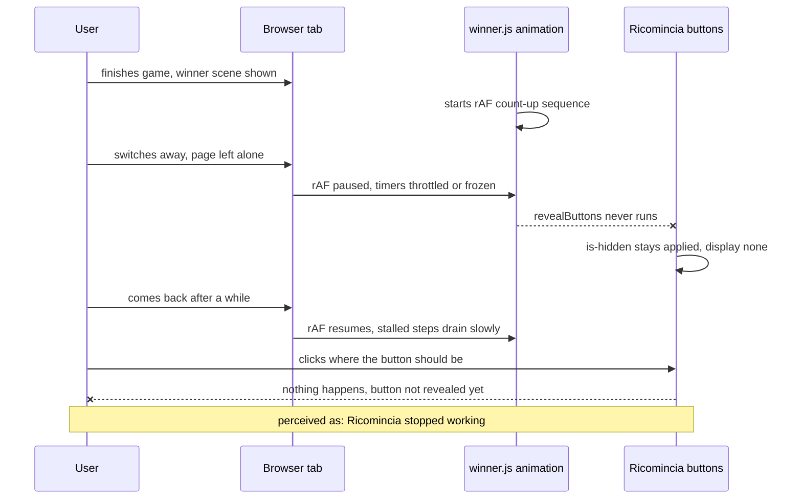

# Radix Card Game — Code Error Analysis

Static code analysis (no tests executed, no website run). Focus: stability errors, with special attention to the reported symptom: *"when the winner page is left alone for a while, the Ricomincia button stops working"*.

> **Last updated:** 2026-09-04 — full re-verification against current codebase. Each issue is marked **STILL PRESENT**, **FIXED**, or **PARTIALLY FIXED**.

---

## 1. Root cause of the reported "Ricomincia stops working" bug

### 1.1 — CRITICAL: the winner animation depends on `requestAnimationFrame`, which browsers pause when the page is not visible — STILL PRESENT

[`winner.js`](src/js/scenes/winner.js:73) `animateValue()` drives the score/fiches count-up with a `requestAnimationFrame` loop, and the whole entry sequence (including `revealButtons()`, which removes `is-hidden` from the Ricomincia buttons) is chained behind it in the async IIFE at [`winner.js`](src/js/scenes/winner.js:198).

What happens when the winner page is left alone (tab in background, window fully occluded, OS sleep, or Chrome tab-freezing after ~5 minutes hidden):

1. `requestAnimationFrame` callbacks stop firing while the page is not visible.
2. The `animateValue()` promise never resolves, so the sequence stalls and `revealButtons()` at [`winner.js`](src/js/scenes/winner.js:129) **never runs**.
3. The Ricomincia buttons keep the `is-hidden` class (`display: none`, see [`winner.styl`](src/stylus/scenes/winner.styl:49)) — they are invisible and unclickable for as long as the page stays unattended.
4. When the user returns, the queued rAF fires with a huge `elapsed` value, so the stalled animation snaps to its end value, but the sequence still has to drain the remaining `wait()` timeouts (`fichesDelay`, `fichesGap` — each ~1s, and throttled to once per minute by Chrome's intensive throttling if the tab was hidden for 5+ minutes). During this catch-up window the buttons are still hidden — clicks do nothing.
5. Net effect perceived by the user: *"I left the winner page alone for a while, came back, and the Ricomincia button doesn't work."*

There is no `visibilitychange` handling, no wall-clock fallback, and no timeout-based fallback for the reveal. This is the most probable direct cause of the reported symptom.

### 1.2 — CRITICAL: no re-entrancy guard in `SceneManager.goToScene()` — STILL PRESENT

[`SceneManager.js`](src/js/core/SceneManager.js:67) `goToScene()` is async and has no "transition in progress" lock. If a second scene event is emitted while a transition is still running, the two calls interleave their `await`s:

- `restartAnimation()` at [`SceneManager.js`](src/js/core/SceneManager.js:34) removes/re-adds the overlay classes, so the second call restarts the first call's half-finished overlay/text animations (visual glitching, double-firing).
- `onExit()`/`onEnter()` of the same scene can run twice in overlapping order, which orphans scene listeners (see 1.3) and can abort the winner scene's button listeners while the scene is still on screen — the Ricomincia buttons then appear normal but no handler is attached.

### 1.3 — CRITICAL: scene modules overwrite their `AbortController` without aborting the previous one — STILL PRESENT

Every scene does `controller = new AbortController()` in `onEnter()` ([`winner.js`](src/js/scenes/winner.js:137), [`welcome.js`](src/js/scenes/welcome.js:19), [`bet.js`](src/js/scenes/bet.js:47), [`characterSelect.js`](src/js/scenes/characterSelect.js:19), [`gamePlay.js`](src/js/scenes/gamePlay.js:78)).

If `onEnter()` runs twice without an `onExit()` in between (possible via 1.2), the first controller is simply overwritten — its listeners are **never removed**. The leaked listeners keep firing on every click (they read the module-level `p1Ready`/`p2Ready` flags and emit scene events), so each subsequent game compounds the problem: one click → multiple emits → multiple concurrent transitions → more leaked listeners. This is a slow-burn instability that makes the app behave erratically after several rounds.

### 1.4 — HIGH: winner and welcome buttons have no re-click guard — CSS-only protection — STILL PRESENT

[`winner.js`](src/js/scenes/winner.js:265) and [`welcome.js`](src/js/scenes/welcome.js:21) add `disabled` (a CSS class) on click but have **no `if (!pXReady)` guard**, unlike [`bet.js`](src/js/scenes/bet.js:118) and [`characterSelect.js`](src/js/scenes/characterSelect.js:89).

The `disabled` class only applies `pointer-events: none` ([`button.styl`](src/stylus/components/button.styl:43)), which blocks **mouse** events but not keyboard-activated clicks (Enter/Space on a focused button). A keyboard re-click after both players are ready re-emits `scene:welcome` while the transition is already running → triggers the concurrent-transition scenario of 1.2. The correct fix is the HTML `disabled` attribute (or a JS guard).

### 1.5 — HIGH: `characterSelect.js` emits the scene event outside the readiness guard — STILL PRESENT

[`characterSelect.js`](src/js/scenes/characterSelect.js:100) and [`characterSelect.js`](src/js/scenes/characterSelect.js:122): the `EventBus.emit('scene:bet')` call sits **outside** the `if (!pXReady)` block. Any re-activation of the button (keyboard, as in 1.4) re-emits the event even though the player was already ready → concurrent transitions (1.2).

Note: [`bet.js`](src/js/scenes/bet.js:123) has the emit correctly **inside** the `if(!pXReady)` guard — only `characterSelect.js` is affected.

### 1.6 — HIGH: `gamePlay` timer can be orphaned and emit a stray `scene:winner` — STILL PRESENT

[`gamePlay.js`](src/js/scenes/gamePlay.js:280) stores the interval id in the module-level `timerInterval`. If `onEnter()` ever runs twice (via 1.2), the first interval id is lost and that interval **can never be cleared** — `clearInterval(timerInterval)` at [`gamePlay.js`](src/js/scenes/gamePlay.js:312) clears only the newest id. The orphaned interval keeps counting down its own closure `remaining` and, when it reaches 0, emits `scene:winner` again — a stray scene transition at an arbitrary later moment (e.g., while the user is on the winner page: it would abort the Ricomincia listeners mid-scene, re-hide the buttons and restart the animation — the user experiences "the button died"). Currently this requires 1.2/1.4 to trigger, but it is a landmine directly aligned with the reported symptom.

### 1.7 — MEDIUM: cancelled `wait()` promises never settle — STILL PRESENT

[`winner.js`](src/js/scenes/winner.js:60): when `onExit()` clears the pending timeouts at [`winner.js`](src/js/scenes/winner.js:287), the `wait()` promises never resolve and the async animation chain stays pending forever. The `entryToken` check makes the stale chain inert, but every interrupted entry leaves a dangling promise chain (same for cancelled `animateValue` frames). A cleaner pattern is to resolve with a "cancelled" flag and check it.

---

## 2. Other stability / robustness errors

### 2.1 — Untracked timers and rAF loops in `gamePlay` — STILL PRESENT

- The turn-switch delay in [`gamePlay.js`](src/js/scenes/gamePlay.js:117) uses `await new Promise(resolve => setTimeout(resolve, ANIM.turnSwitchDelay))` — this setTimeout is not tracked and not cancelled on exit; it fires after the scene is gone. It is only *accidentally* harmless because `gameEnded` is always true by then — fragile implicit coupling.
- `animateScore()` at [`gamePlay.js`](src/js/scenes/gamePlay.js:199) runs an untracked rAF loop that is not cancelled on exit (self-terminating, but mutates hidden DOM after exit).

### 2.2 — `pendingFrames` grows without bound during animations — STILL PRESENT

[`winner.js`](src/js/scenes/winner.js:92): every animation frame pushes a new id into `pendingFrames`; completed frame ids are never removed (only wholesale-cleared on exit at [`winner.js`](src/js/scenes/winner.js:290)). Harmless today, but sloppy and a leak pattern.

### 2.3 — No error handling in the transition pipeline — STILL PRESENT

`goToScene()` is async and its promise is discarded by the EventBus handlers at [`SceneManager.js`](src/js/core/SceneManager.js:110). Any exception thrown inside `onEnter()`/`onExit()` becomes an unhandled rejection and **freezes the transition mid-way**: the overlay stays white (`is-fading-in`, `forwards`), the scene is never swapped, and there is no recovery path.

### 2.4 — Sounds are never stopped on scene exit — STILL PRESENT

[`Audio.js`](src/js/core/Audio.js:74) `playSound()` has no stop/cancel mechanism: `winner.mp3` keeps playing after leaving the winner scene. The audio engine was rewritten to use Web Audio API (AudioBufferSourceNodes instead of cloneNode), but the fundamental issue remains — there is no way to stop a playing sound. [`Audio.js`](src/js/core/Audio.js:111) `playTickSound()` creates a new source node per tick (no pooling, but source nodes are garbage-collected after playback, so this is acceptable with Web Audio).

### 2.5 — `startTimer()` never initializes the time bar width — STILL PRESENT

[`gamePlay.js`](src/js/scenes/gamePlay.js:278) sets the text but not `gameTimeBar.style.width` on entry; it relies on `onExit()` having set it to `'100%'` ([`gamePlay.js`](src/js/scenes/gamePlay.js:315)). On the very first game the width comes only from the invalid HTML `width` attribute (see 4.2) — the bar may not render correctly until the first tick.

### 2.6 — DOM queries at module load with no null checks — STILL PRESENT

All scene modules query DOM elements at import time (e.g., [`winner.js`](src/js/scenes/winner.js:33), [`welcome.js`](src/js/scenes/welcome.js:9), [`bet.js`](src/js/scenes/bet.js:11), [`characterSelect.js`](src/js/scenes/characterSelect.js:10), [`gamePlay.js`](src/js/scenes/gamePlay.js:32)). A single selector typo would crash the whole app at load with an unhelpful `TypeError`. Currently all selectors match, but this is fragile.

---

## 3. Logic / data errors

### 3.1 — Winner results are never written back to the Store — STILL PRESENT

[`winner.js`](src/js/scenes/winner.js:231): the loser's bet count-down to 0 and the winner's bet doubling are **purely visual** — `animateValue()` only updates `element.textContent`. `Store.players[x].bet` and `score` are never updated, so the outcome of the round is not persisted anywhere.

### 3.2 — `gameMaxPoints` / `gameMinPoints` are never used — STILL PRESENT

[`settings.js`](data/settings.js:3) defines them, but `drawCard()` at [`gamePlay.js`](src/js/scenes/gamePlay.js:145) does `player.score += card.score` with no clamping — scores are unbounded and can go negative despite the settings implying limits.

### 3.3 — `resetStore()` does not reset `currentPhase` — STILL PRESENT

[`Store.js`](src/js/core/Store.js:30) resets players but leaves `Store.currentPhase` untouched. Latent bug (the field is currently unused).

### 3.4 — Duplicate DOM ids — STILL PRESENT

`generateCharacterCard()` assigns `id="character-card-N"` ([`Utils.js`](src/js/core/Utils.js:52)) and `populateCharacters()` clones the card for player 2 ([`Utils.js`](src/js/core/Utils.js:29)) — every character id exists **twice** in the document (invalid HTML; `querySelector('#character-card-0')` only ever returns P1's).

### 3.5 — Dead / unused code — PARTIALLY FIXED

- [`main.js`](src/js/main.js:2): `Store` and `resetStore` are imported but never used. **STILL PRESENT**.
- [`Utils.js`](src/js/core/Utils.js:111): `translateSkillKey()` maps `speed` and `defense`, which no character or card uses. **STILL PRESENT**.
- `assets/sounds/soundtrack.mp3` and `assets/sounds/moneys.mp3` are never played. **STILL PRESENT**.
- [`gamePlay.js`](src/js/scenes/gamePlay.js:95): leftover `console.log("gameIsOver")`. **STILL PRESENT**.
- ~~[`gamePlay.js`](src/js/scenes/gamePlay.js:85): six copy-pasted click handlers~~ — **FIXED**. The six handlers have been refactored into a clean loop with a shared `handleDeckClick()` function at [`gamePlay.js`](src/js/scenes/gamePlay.js:104).

---

## 4. HTML / markup errors

### 4.1 — Stray double quote in `class` attributes — STILL PRESENT

`class="scene""` on [`index.html`](index.html:19), [`index.html`](index.html:115), [`index.html`](index.html:172), [`index.html`](index.html:265). Browsers tolerate it, but it is malformed markup.

### 4.2 — Invalid `width` attribute — STILL PRESENT

[`index.html`](index.html:179): `
` — `width` is not a valid attribute for a div; it is ignored. The width only works because JS sets `style.width`.

### 4.3 — Invalid element nesting — STILL PRESENT

`populateCharacters()` appends `
` thumbnails directly inside the `<ul id="list-thumbnails">` ([`Utils.js`](src/js/core/Utils.js:18)) — only `<li>` is valid there.

### 4.4 — Typo in id — STILL PRESENT

[`index.html`](index.html:183): `game-play-contianer` (should be `container`). Works, but misspelled.

### 4.5 — Redundant `defer` — STILL PRESENT

[`index.html`](index.html:7): `type="module"` scripts are deferred by default; `defer` is redundant (harmless).

---

## 5. Failure mechanism of the reported bug

Secondary compounding path: a single keyboard re-click (1.4/1.5) or any double scene emit triggers concurrent transitions (1.2), which leak listeners (1.3) and can orphan the gameplay timer (1.6) — after that, stray `scene:winner` transitions can abort the Ricomincia listeners while the scene is visible, producing the same symptom even without leaving the page alone.

---

## 6. Summary table

| # | Severity | Area | Error | Status |
|---|----------|------|-------|--------|
| 1.1 | Critical | winner.js | rAF-dependent animation stalls when page unattended → buttons never revealed | **Still present** |
| 1.2 | Critical | SceneManager.js | No re-entrancy guard on goToScene | **Still present** |
| 1.3 | Critical | all scenes | AbortController overwritten without aborting → listener leaks | **Still present** |
| 1.4 | High | winner.js, welcome.js | No re-click guard; CSS-only disabling bypassed by keyboard | **Still present** |
| 1.5 | High | characterSelect.js | Scene emit outside the readiness guard | **Still present** |
| 1.6 | High | gamePlay.js | Timer id overwrite can orphan an interval that later emits a stray scene:winner | **Still present** |
| 1.7 | Medium | winner.js | Cancelled wait() promises never settle | **Still present** |
| 2.1 | Medium | gamePlay.js | Untracked setTimeout / rAF after exit | **Still present** |
| 2.2 | Low | winner.js | pendingFrames grows unbounded during animation | **Still present** |
| 2.3 | Medium | SceneManager.js | No error handling; a throw freezes the transition white | **Still present** |
| 2.4 | Low | Audio.js | Sounds never stopped on exit; no cancel mechanism | **Still present** |
| 2.5 | Low | gamePlay.js | Time bar width not initialized on first entry | **Still present** |
| 2.6 | Low | all scenes | Module-load DOM queries without null checks | **Still present** |
| 3.1 | Medium | winner.js | Round outcome never persisted to Store | **Still present** |
| 3.2 | Medium | gamePlay.js, settings.js | Score never clamped; max/min points settings unused | **Still present** |
| 3.3 | Low | Store.js | resetStore ignores currentPhase | **Still present** |
| 3.4 | Medium | Utils.js | Duplicate character-card DOM ids | **Still present** |
| 3.5 | Low | several | Dead code, unused imports, leftover console.log | **Partially fixed** — gamePlay click handlers refactored |
| 4.1 | Low | index.html | Stray quote in class attributes | **Still present** |
| 4.2 | Low | index.html | Invalid width attribute | **Still present** |
| 4.3 | Low | Utils.js | divs inside ul | **Still present** |
| 4.4 | Low | index.html | contianer typo | **Still present** |
| 4.5 | Low | index.html | Redundant defer | **Still present** |

---

## 7. Changes since last analysis

| Change | Details |
|--------|---------|
| Audio engine rewritten | `Utils.js` playSound/playTickSound replaced by [`Audio.js`](src/js/core/Audio.js:1) Web Audio engine (AudioBufferSourceNodes, preloading, safety cap). Issue 2.4 description updated accordingly — the fundamental problem (no stop mechanism) persists. |
| gamePlay click handlers refactored | Six copy-pasted handlers replaced by a loop + shared [`handleDeckClick()`](src/js/scenes/gamePlay.js:104). Issue 3.5 partially resolved. |
| winner.js animation sequence restructured | The async IIFE and `entryToken` pattern were added (likely in response to the original analysis), but the core rAF dependency (1.1) and dangling promise issue (1.7) remain. |
| Line numbers updated | All line references refreshed to match current codebase. |

**Overall: 22 of 23 issues still present. 1 issue partially fixed (3.5 — gamePlay click handler refactor).**
